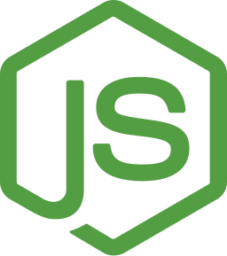

## Hello there, Zheng Teck (Zen) here! 👋🏼

I'm a second year Computer Science undergraduate at the National University of Singapore, previously from Ngee Ann Polytechnic, Business IT. I am passionate about technology ranging from blockchain to fullstack development to devops. I am an aspiring entrepreneur and enjoy working on projects in my free time.

Current Project(s): [OneBoard](https://www.notion.so/OneBoard-de636bf19ff84cde83d7fff0104f2e7b) | Employment: [MonoX](https://monox.finance/) & [Alphaese](http://alphaese.com/)

## Languages & Technologies

  
  &nbsp;
  
  &nbsp;
  
  &nbsp;
  
  &nbsp;
  
  &nbsp;
  
  &nbsp;
  

## Contact

  
  &nbsp;
  
  &nbsp;
  

Email: [NUS Computing (Main)](mailto:zhengt@comp.nus.edu.sg) | [Microsoft LSA](mailto:zhengteck.goh@studentambassadors.com)
<!--
## Others
- Crypto News Telegram Channel - [de-crypto-station](https://t.me/decryptostation)
-->
<!-- 

##References

Aditya Vikram Singh - https://github.com/AVS1508
Zhu Hanming - https://github.com/zhuhanming

-->

<!--
**laughingkid-sg/laughingkid-sg** is a ✨ _special_ ✨ repository because its `README.md` (this file) appears on your GitHub profile.

Here are some ideas to get you started:

- 🔭 I’m currently working on ...
- 🌱 I’m currently learning ...
- 👯 I’m looking to collaborate on ...
- 🤔 I’m looking for help with ...
- 💬 Ask me about ...
- 📫 How to reach me: ...
- 😄 Pronouns: ...
- ⚡ Fun fact: ...
-->
